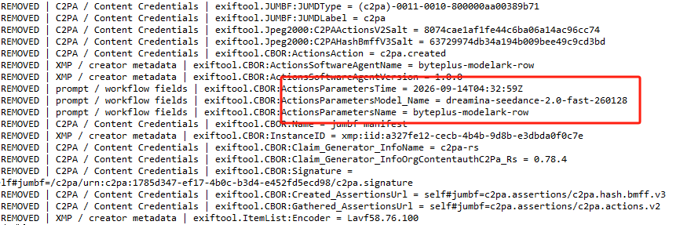
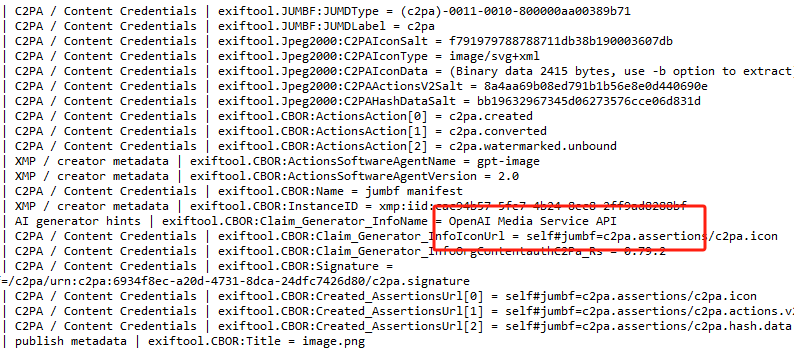
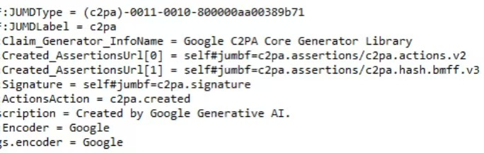

# MemeR-AI图文视频印记数据清理

面向 Windows 与 Codex 的本地图片/视频文件层元数据清理工具。支持图形界面、批量处理、清理前后复查，以及 HTML/TXT/JSON 三种报告。

> 本工具用于文件层元数据卫生与误标风险排查，不承诺绕过 TikTok 或其他平台的 AI 识别，不删除隐形水印，也不改变平台披露义务。

## 它解决什么问题

图片或视频在生成、编辑、导出和转发过程中，可能携带软件名、提示词、模型名、工作流、时间、作者、C2PA/JUMBF 等文件层字段。MemeR-AI 会执行“清理前扫描 → 像素重存或视频重编码 → 深度清理 → 再次扫描”，并明确告诉你哪些字段已经消失、哪些字段仍然存在。

适合以下场景：

- 发布前检查图片或视频是否携带不必要的生成软件、提示词或作者信息。
- 批量清理素材中的 EXIF、XMP、QuickTime、C2PA/JUMBF 等文件层数据。
- 排查平台误标风险，但不把结果误解为“绕过 AI 识别”。
- 为处理过程保留可读、可视化、可供自动化读取的审计记录。

## 一键安装 Codex Skill

在 PowerShell 中运行：

```powershell
powershell -NoProfile -ExecutionPolicy Bypass -Command "irm https://raw.githubusercontent.com/sanadayu3/memer-ai-media-mark-cleaner/main/install.ps1 | iex"
```

安装完成后重新打开 Codex，直接提出“清理这些图片/视频的文件层元数据并显示报告”，或显式调用：

```text
$memer-ai-media-mark-cleaner
```

安装脚本会下载最新 Skill 文件和共享 Windows 运行包，分别校验 SHA-256，自动组装完整 Skill，并在覆盖旧版前创建时间戳备份。运行包只下载一份，不会重复下载同一套 FFmpeg/ExifTool。

### Codex 使用示例

安装后可以直接对 Codex 说：

```text
使用 $memer-ai-media-mark-cleaner 清理 D:\素材\待发布 中的图片和视频，
输出到 D:\素材\已清理，并汇总已清除和仍残留的字段。
```

只检查、不生成新文件：

```text
使用 $memer-ai-media-mark-cleaner 扫描这批素材，只做风险排查，不清理文件。
```

打开桌面图形界面：

```text
使用 $memer-ai-media-mark-cleaner 启动图形界面。
```

## 下载独立 EXE

- [下载 Windows 便携版](https://github.com/sanadayu3/memer-ai-media-mark-cleaner/releases/latest/download/MemeR-AI%E5%9B%BE%E6%96%87%E8%A7%86%E9%A2%91%E5%8D%B0%E8%AE%B0%E6%95%B0%E6%8D%AE%E6%B8%85%E7%90%86-portable.zip)
- [查看最新 Release](https://github.com/sanadayu3/memer-ai-media-mark-cleaner/releases/latest)

解压后双击 `MemeR-AI图文视频印记数据清理.exe`。移动时请保留整个文件夹，不能只移动 EXE。

## GUI 使用教程

1. 解压便携包，打开完整文件夹。
2. 双击 `MemeR-AI图文视频印记数据清理.exe`。
3. 点击“添加文件”选择一张或多张图片/视频；也可以点击“添加文件夹”批量导入。
4. 确认输出目录。默认在第一个源文件旁创建 `metadata_cleaned`。
5. 点击“开始清理”。视频会重新编码，耗时取决于时长、分辨率和电脑性能。
6. 在窗口日志查看每个文件的 `REMOVED` 和 `REMAINS`。
7. 完成后点击“打开可视化报告”，浏览器会打开 `clean_report.html`。

源文件不会被覆盖。清理后的文件会使用 `_clean` 后缀；同名文件已存在时自动增加序号。

更完整的安装、操作和报告解读见：[中文使用教程](docs/使用教程.md)。

## 功能

- 图片：JPEG、PNG、WebP、BMP、TIFF。
- 视频：MP4、MOV、M4V、AVI、MKV、WebM。
- 检查并清理 EXIF、XMP、QuickTime、JUMBF、C2PA、Content Credentials。
- 识别生成软件、模型、提示词、工作流、种子及常见发布字段。
- 视频重编码为 MP4 / H.264 / AAC，并移除章节、字幕轨、数据轨与普通 metadata。
- 每个文件显示 `REMOVED`（已清除）和 `REMAINS`（复查残留）。
- 生成可视化 `clean_report.html`、审计记录 `clean_report.txt` 和结构化 `clean_report.json`。
- 内置 FFmpeg、ffprobe 与 ExifTool，无需另行安装。

## 输出示例

### Seedance：清理 C2PA/JUMBF、模型名与参数字段



### OpenAI/ChatGPT：识别 Content Credentials 与生成器字段



### Google：识别 C2PA Core Generator 与生成描述



截图中的字段仅用于演示文件层扫描与复查输出，不代表对任何平台检测结果的保证。

## 报告说明

处理完成后，输出目录包含：

- 清理后的图片或 MP4 视频。
- `clean_report.html`：浏览器可打开的可视化报告。
- `clean_report.txt`：逐项列出已清除与残留痕迹。
- `clean_report.json`：供 Codex 或自动化读取。

MP4 容器可能重新生成 `handler_name`、`HandlerDescription` 或 codec `encoder` 等结构字段。报告会将其列为残留，但它们本身不等于 AI 来源证明。

### 如何理解状态

- `REMOVED`：清理前命中、清理后不再出现的风险字段。
- `REMAINS`：清理后复查仍能看到的字段，需要人工判断。
- `ERROR`：该文件处理失败或某个扫描器不可用，不应把它当作清理成功。
- 残留为 0：只代表当前文件层扫描未再命中，不代表内容不是 AI，也不代表平台不会识别。

## 更新与卸载

更新：再次运行一键安装命令。安装器会先把旧版本备份为带时间戳的文件夹，再安装最新版本。

卸载：关闭 Codex 后删除下面的文件夹：

```text
%USERPROFILE%\.codex\skills\memer-ai-media-mark-cleaner
```

安装器创建的旧版备份位于同一目录，名称类似 `memer-ai-media-mark-cleaner.backup-20260916-120000`。

## 常见问题

**为什么 EXE 只有几 MB，却不能单独移动？**  
FFmpeg、ExifTool、Python 与界面运行库都放在旁边的 `_internal` 文件夹中，因此必须移动整个目录。

**为什么视频处理比图片慢？**  
视频会重新编码为 H.264/AAC，而不是只改文件头，以减少旧容器和轨道元数据被保留的机会。

**为什么视频仍显示 `handler_name` 或 `encoder`？**  
部分 MP4 结构字段由编码器或封装器重新生成，通常只是容器默认值。报告会保留它们，避免给出“100% 清空”的错误结论。

**会删除原文件吗？**  
不会。软件始终写入新的清理后文件。

## 仓库内容

- `skill/`：Skill 指令、清理核心与 Codex 启动器源码。
- `install.ps1`：带校验与旧版本备份的一键安装器。
- `docs/images/`：真实输出示例。
- GitHub Releases：完整 Codex Skill ZIP 与 Windows EXE 便携包。

## 第三方组件

发行包内含 FFmpeg/ffprobe 与 ExifTool。它们分别遵循各自项目许可；本仓库中的 Skill 指令与启动脚本不改变这些第三方许可。
